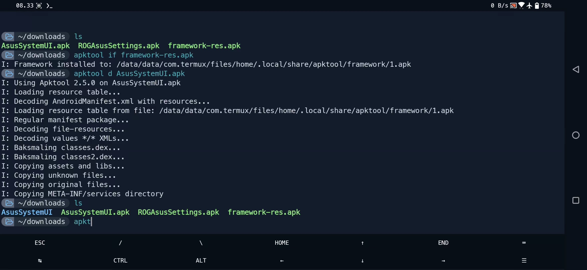

[](https://github.com/rendiix/termux-apktool/network/)
[](https://github.com/rendiix/termux-apktool/stargazers/)

[](https://github.com/rendiix?tab=followers)
[](https://github.com/rendiix/termux-apktool/graphs/contributors/)

# termux-apktool
Apktool v2.6.0-SNAPSHOT 
## Fully working apktool on termux without proot or root
[](https://www.youtube.com/watch?v=sAREsUFv1BM)
#### Install:
``` console
$ git clone https://github.com/rendiix/termux-apktool.git
$ cd termux-apktool
$ bash install.sh
```
#### Oneline installation:
``` console
$ curl -s https://raw.githubusercontent.com/rendiix/termux-apktool/main/install.sh | bash
```

#### If you are already subscribed to my PPA repo:
``` console
$ pkg install apktool
```
#### Join Discord or follow me on Twitter:

[](https://discord.gg/5PmKhrc)
[](https://twitter.com/rendiix)
